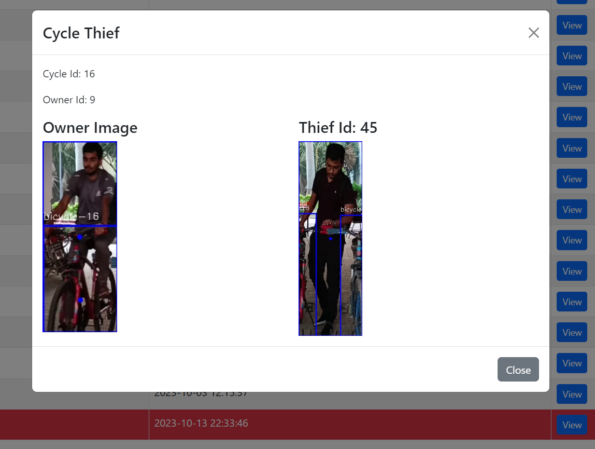
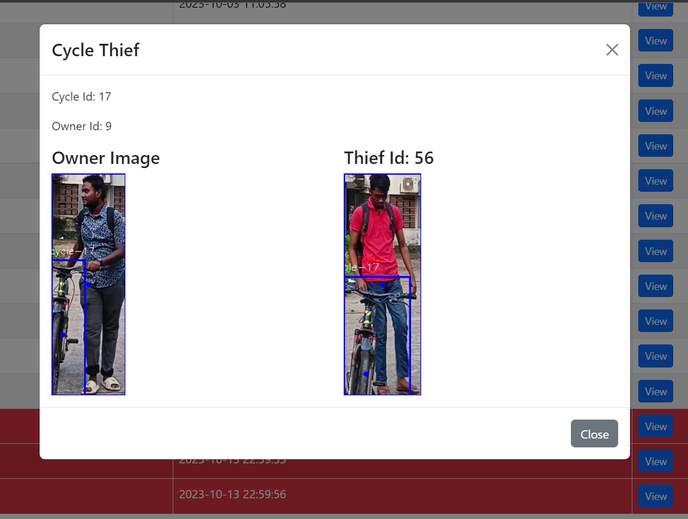

# Cycle Thief Detection from Live CCTV Footage using YOLOv5 and DeepSORT

## Aim
The objective of this project is to detect cycle theft in real-time using CCTV footage. By utilizing advanced machine learning and tracking algorithms, the system identifies potential theft incidents and notifies authorities with evidence, including the thief's image, through a web interface.

## Approach
1. **Data Collection**: Videos were recorded in cycle garages and parking lots for analysis.
2. **Object Detection & Tracking**:
   - **YOLOv5s** was employed to detect cycles and persons in each video frame.
   - **DeepSORT** was used for tracking individuals and cycles by assigning unique IDs to both.
3. **Cycle-Owner Matching**:
   - A **KD-tree algorithm** was utilized to identify the nearest cycle-person pairs, aiming to match each person with their cycle.
   - An algorithm was then developed to determine the rightful owner of the cycle.
4. **Face Matching**: If a person moved a cycle, the system used **Face Recognition** to check if the individual was the owner or a thief.
5. **Alert Mechanism**: In case of theft, an alert was sent to the authorities, and the thief's image was displayed on a web page built with HTML, CSS, Bootstrap, and connected to a **Firebase Realtime Database**.

## Result

The system effectively detects cycle theft in parking areas, notifies the relevant authorities, and provides visual evidence through a web interface.

### Demo

    

        
        

            <a href="https://drive.google.com/file/d/1hRaNBUr8qKRgM-IGYBAFS8Z2d4haFuB7/view?usp=sharing" target="_blank" style="margin-right: 10px; padding: 10px; background-color: #007bff; color: white; text-decoration: none; border-radius: 5px; display: inline-block;">Show Video</a>
            <a href="https://drive.google.com/uc?export=download&id=1hRaNBUr8qKRgM-IGYBAFS8Z2d4haFuB7" download style="padding: 10px; background-color: #28a745; color: white; text-decoration: none; border-radius: 5px; display: inline-block;">Download</a>
        

    

    

        
        

            <a href="https://drive.google.com/file/d/1EQkJFXMIShyaoj5bTtycqtHGrM9KCtmu/view?usp=sharing" target="_blank" style="margin-right: 10px; padding: 10px; background-color: #007bff; color: white; text-decoration: none; border-radius: 5px; display: inline-block;">Show Video</a>
            <a href="https://drive.google.com/uc?export=download&id=1EQkJFXMIShyaoj5bTtycqtHGrM9KCtmu" download style="padding: 10px; background-color: #28a745; color: white; text-decoration: none; border-radius: 5px; display: inline-block;">Download</a>
        

    

Note: The videos show CCTV footage, while the images display alert notifications from the web interface.

